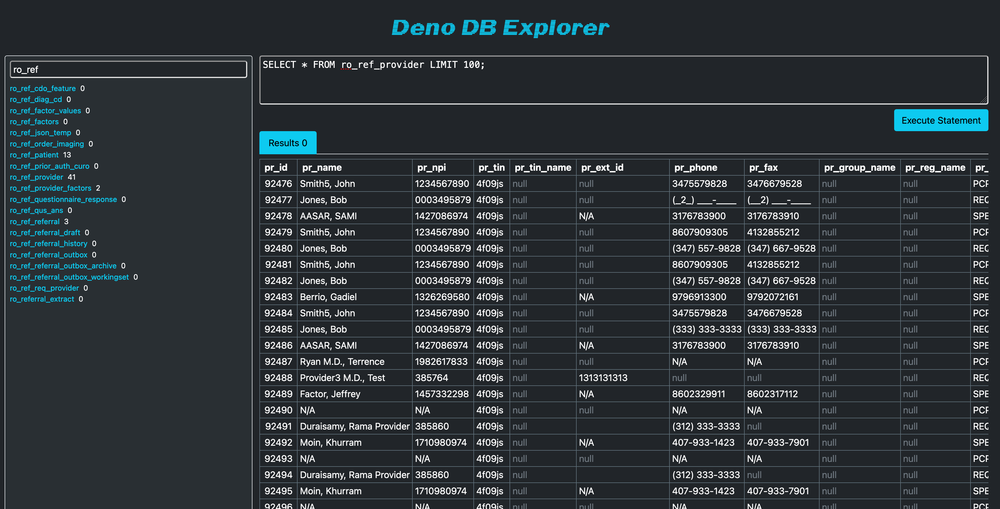

# Deno DB Explorer

A client browser based MySQL connector to interact with a local or remote database explorer built with Deno!

### Prerequisite
Make sure you have the latest version of `deno` installed on your machine, you can find that download here if needed: https://deno.com/

## Setup

To connect you need to define the following environment variables to define the connection string
```sh 
export DDBE_HOSTNAME='localhost'
export DDBE_PORT='3306' # default port is 3306
export DDBE_DATABASE_NAME='database'
export DDBE_USERNAME='admin'
export DDBE_PASSWORD='admin'
```

## Running the Application

Once configuration has been made, then just simply start the Deno process either by running the `run` command or the provided `start.sh` script in the current working directory

`sh start.sh` OR `deno run -A ./main.ts`

The server will then be running and you can access it on the default port at `http://localhost:8000` and you should be able to see something like the following




### Handling Errors

If you have trouble starting and working with the tool, *follow the console logs*

If your scripts or statements have errors interacting with the DB they will returned to you in a tabular format to find out what may have gone wrong

All statements are run in a within a `TRANSACTION` process, so if any of the script provided in the textarea errors then the entire change will be `ROLLBACK` and none of the changes/modifications will take affect in your DB

# Future Enhancements
 - View table metadata and definitions :scroll:
 - Resizable columns :left_right_arrow:
 - Export results tab :floppy_disk:
 - Custom Theming :art:
 - Multiple Database configurations :dancers:
 - SQL statement history :memo:
 - Running SQL from a `.sql` import (copy and paste for now :wink:)
 - More pretty :sparkles: